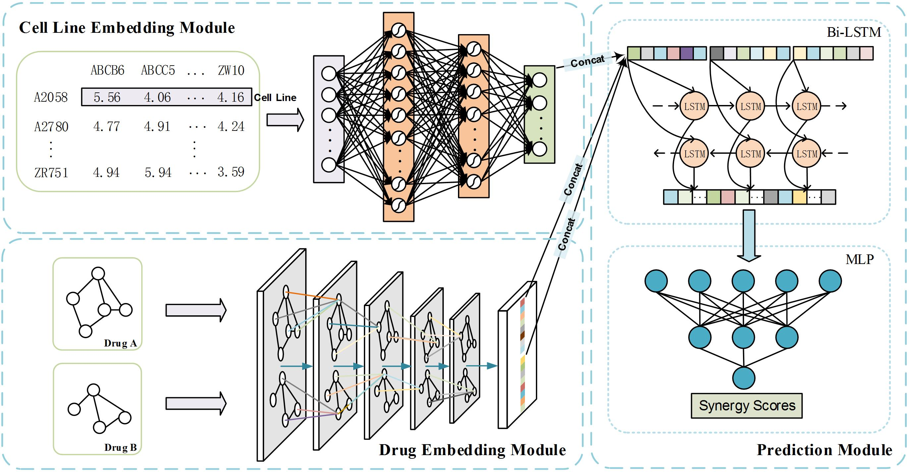

# A Deep Neural Network for Predicting SynergisticDrug Combinations on Cancer

This code repository is the supporting material in the paper. In this paper, we propose a novel approach called GTextSyn, whichleverages the integration of chemical structure data and gene expression data topredict the synergistic effects of drug combinations.



## Requirements

The third-party dependencies required for model running are listed in [environment.yaml](./environment.yaml). Specifically, you can use the following command to create an environment based on conda and pip:

```bash
conda create -n GTextSyn python=3.7
conda activate GTextSyn
conda install pytorch==1.13.1 torchvision==0.14.1 torchaudio==0.13.1 pytorch-cuda=11.7 -c pytorch -c nvidia
conda install -c dglteam/label/cu117 dgl
conda install -c conda-forge rdkit==2018.09.3
pip install dgllife
```

## Data preparation

All data used in this paper are public and accessible. The relevant dataset has been stored in [Cloud Drive](https://drive.google.com/drive/folders/1mgCB3NJJB4RXE_KrxmdlQK7_LXtU66kh?usp=sharing) and can be downloaded to the "data/raw/" folder. Please refer to the [DATA README](./data/raw/README.md) for the source of each file.

After downloading the relevant dataset and place it in the "data/raw/" folder you can generate the training set and test set by running

```bash
python dataproc.py
```

## Training

After generating the traning set and test set (ONEIL_train.pkl、ONEIL_test.pkl) you can start training the model by running

```bash
python main.py
```
